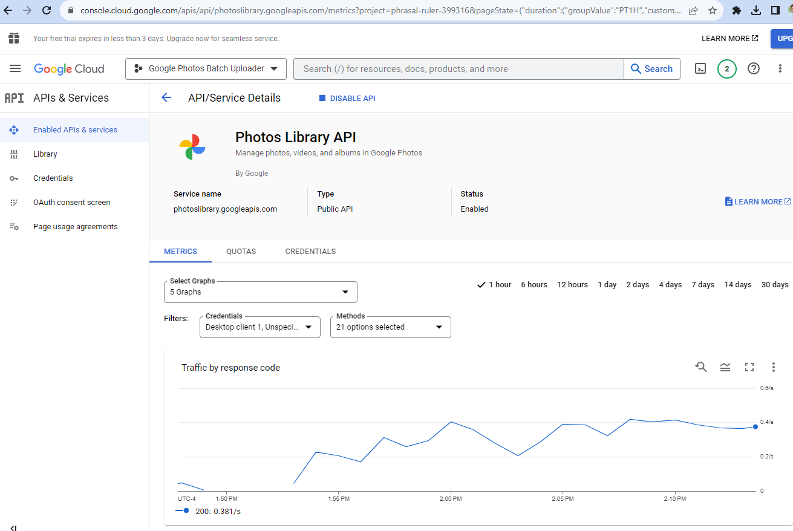

# google_photos_batch_uploader
Google Photos Backup and Sync was discontinued 2 years ago and I did not realize this. I had thousands of images I wanted to upload that I found, and decided to just code this as doing manually would take too long.

Here's a sample set of uploaded files in a folder:


As it runs, it will print out progress:


Do keep tabs on the processing, especially in Google Cloud API Service details:


Note that you may need to adjust certain things like your quota:

```
googleapiclient.errors.HttpError: <HttpError 429 when requesting https://photoslibrary.googleapis.com/v1/mediaItems:batchCreate?alt=json returned "Quota exceeded for quota metric 'Write requests' and limit 'Write requests per minute per user' of service 'photoslibrary.googleapis.com' for consumer 'project_number:515433750482'.". Details: "[{'@type': 'type.googleapis.com/google.rpc.ErrorInfo', 'reason': 'RATE_LIMIT_EXCEEDED', 'domain': 'googleapis.com', 'metadata': {'service': 'photoslibrary.googleapis.com', 'quota_location': 'global', 'quota_limit': 'WritesPerMinutePerUser', 'consumer': 'projects/515433750482', 'quota_metric': 'photoslibrary.googleapis.com/write_requests', 'quota_limit_value': '30'}}, 
{'@type': 'type.googleapis.com/google.rpc.Help', 'links': [{'description': 'Request a higher quota limit.', 'url': 'https://cloud.google.com/docs/quota#requesting_higher_quota'}]}]">
```


